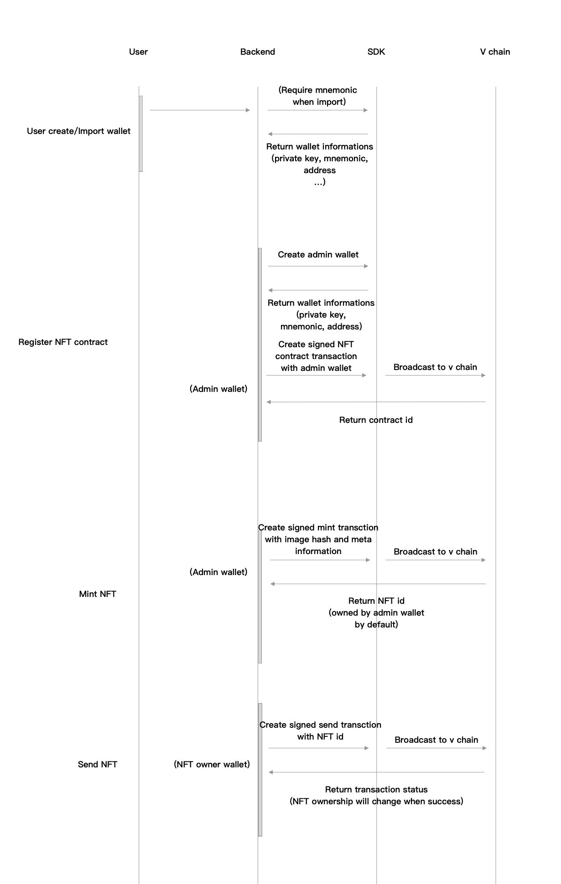

# vsys-nft-bundle
A golang wrapper for vsys api service.

## Quick start
Configure the "config.json" file before run the api server. 

```
go run main.go api
```
The service is running on :7005 port, and you can visit the swagger document on http://127.0.0.1:7005/swagger/index.html 

## Process Guide
